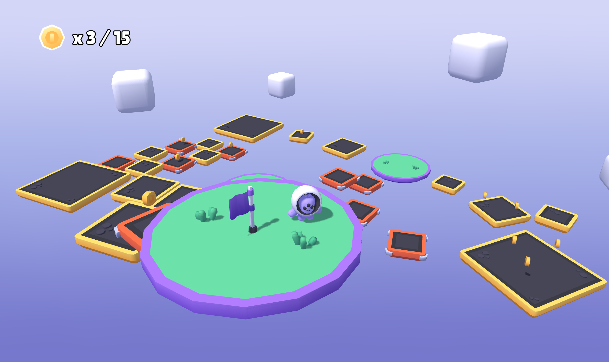

# 3D Platformer Starter Kit

This is a small, ready-to-play 3D platformer sample game made with [Defold](https://defold.com/) inspired by the [Kenney 3D Platformer Starter Kit](https://github.com/KenneyNL/Starter-Kit-3D-Platformer) and using his assets.

It's MIT licensed, you can use it freely, e.g. as a starting point for your own game, or as a compact example and learning resource of how a 3D Defold project can be build.

## What is included

- Responsive character movement controller with keyboard and mouse or gamepad input support
- Jumping, a mid-air (double) jump, and forgiving jump timing (buffering)
- A camera setup that smoothly follows the player and can be rotated around and zoomed
- Animated characters with additional simple squash, stretch, and 3D dust particles effects
- Collectible coins with billboarded particle effects and sounds
- Static and falling platforms
- A goal flag with win condition, and an automatic round reset
- Custom rendering pipeline with directional lighting, adaptive soft (PCF) shadows, and a custom sky gradient
- A small example level that is easy to edit

## Run the project

1. Download and install [Defold](https://defold.com/download/). This project currently requires Defold 1.13.1 or newer because it uses the Light component.
2. Start Defold and choose **Open From Disk…**.
3. Select this project's `game.project` file and open the project.
4. In an opened editor select <kbd>Project ▸ Build</kbd> to build and run the game locally.

## Play the example level

Collect 15 coins, then reach the flag. Five seconds after winning, the player and score reset so you can try again.

- Use <kbd>W</kbd><kbd>A</kbd><kbd>S</kbd><kbd>D</kbd>, a gamepad's <kbd>left stick</kbd>, or the <kbd>D-pad</kbd> to move the character relative to the camera.
- Press <kbd>Space</kbd> or a gamepad's <kbd>south face button</kbd> (e.g. <kbd>A</kbd> on Xbox controllers) to jump or double-jump.
- Move the mouse or use the arrow keys or a gamepad's right stick to rotate the camera around the character.
- Use the mouse wheel or gamepad shoulder buttons to change the camera distance (zoom).
- Press <kbd>Escape</kbd> to release the captured mouse input. Click inside the game window to capture it again and resume rotating the camera.

Click inside the game window to capture the mouse again.

## A few useful Defold terms

If this is your first Defold project, these four terms will help when browsing the editor:

- A **collection** is a scene, level, or group of objects. `game/game.collection` is the main scene in this project.
- A **game object** is a container with a position, rotation, and scale.
- A **component** gives a game object behavior or content, such as a script, model, sound, camera, or collision object.
- A **factory** creates game objects while the game is running. This project uses factories for the player, character visuals, and dust effects.

The official [Defold building blocks guide](https://defold.com/manuals/building-blocks/) explains these concepts with editor examples.

More help is available in the [Defold manuals](https://defold.com/manuals/introduction/).

## Change the example

A good way to learn Defold is to change something in the sample projects, build it, and see what happens. These are some places to begin:

| What you want to change | Where to look |
| --- | --- |
| Run speed, jump height, or gravity | Constants near the top of `game/prefabs/player/player.script` |
| Number of coins needed to win | `MIN_COINS_TO_WIN` in `game/game.script` |
| Coin respawn time | `RESPAWN_DELAY` in `game/prefabs/coin/coin.script` |
| Camera distance, smoothing, or sensitivity | Properties in `game/camera_follow.script` |
| Platform and coin placement | Open `game/game.collection` in the Scene Editor |

After saving a change, select **Project ▸ Build** again. The **Console** and **Build Errors** tabs at the bottom of the editor are the first places to look if something goes wrong.

Read more details about the project structure and code responsibilities in the [Platformer code tour](PLATFORMER.md).

## Project layout

- `game/game.collection` is the main scene and example level.
- `game/game.script` spawns the player and controls the win/reset loop.
- `game/prefabs/` contains reusable players, coins, platforms, effects, and environment objects.
- `game/camera_follow.script` controls the orbit camera.
- `assets/` contains models, images, fonts, sounds, particles, and materials.
- `shadow_mapping/` contains the custom lighting and shadow render pipeline.
- `input/game.input_binding` maps keyboard, mouse, and gamepad input.
- `docs/` contains the ready-made HTML5 demo.

For a deeper explanation of how the gameplay systems connect, read [Platformer code tour](PLATFORMER.md).

### Object interpolation library

The project uses an external community library for Defold:

- [Object Interpolation](https://github.com/indiesoftby/defold-object-interpolation) - smooths the player's visible movement between physics steps.

Its URL is stored in `game.project`.

## Troubleshooting

- **Resources are missing:** select **Project ▸ Fetch Libraries**, wait for it to finish, and build again.
- **The build fails:** open **Build Errors** and start with the first reported error. Later errors are often caused by the first one.
- **The game runs but does not respond to the mouse:** click inside the game window. Press `Escape` when you want to release the mouse.
- **You changed a value but nothing happened:** save the file and rebuild the project.

If you spot any issue, or have troubles with some other things, write on the [Defold forum](https://forum.defold.com/).

## License

The project code is available under the [MIT License](LICENSE).

## Credits

Assets used in the project by [Kenney](https://kenney.nl/assets/), based on [Kenney 3D Platformer Starter Kit](https://github.com/KenneyNL/Starter-Kit-3D-Platformer).